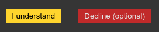

# :cookie: react-cookie-consent :cookie:

A small, simple and customizable cookie consent bar for use in React applications.

[](https://npmjs.org/package/react-cookie-consent)

Demo: https://mastermindzh.github.io/react-cookie-consent/

Example branch: https://github.com/Mastermindzh/react-cookie-consent/tree/example

## Default look


## Installation

``` shell
npm install react-cookie-consent
```

or use yarn:

``` shell
yarn add react-cookie-consent
```

## Using it

You can import the cookie bar like this:

``` js
import CookieConsent from "react-cookie-consent";
```

If you want to set/remove cookies yourself you can optionally import `Cookies` (straight from js-cookie) like this:

``` js
import CookieConsent, { Cookies } from "react-cookie-consent";
```

Then you can use the component anywhere in your React app like so:

```jsx
<CookieConsent>
    This website uses cookies to enhance the user experience.
</CookieConsent>
```

You can optionally set some props like this (next chapter will show all props):

```js
<CookieConsent
    location="bottom"
    buttonText="Sure man!!"
    cookieName="myAwesomeCookieName2"
    style={{ background: "#2B373B" }}
    buttonStyle={{ color: "#4e503b", fontSize: "13px" }}
    expires={150}
>
    This website uses cookies to enhance the user experience.{" "}
    <span style={{ fontSize: "10px" }}>
    This bit of text is smaller :O
    </span>
</CookieConsent>
```

One of the props (onAccept) is a function, this function will be called after the user has clicked the accept button. You can provide a function like so:

```js
<CookieConsent
    onAccept={() => {alert("yay!")}}
>

</CookieConsent>
```

If the decline button is enabled then the (onDecline) prop function can be used, this function will be called after the user has clicked the decline button. You can enable the button and provide a function like so:

```js
<CookieConsent
    enableDeclineButton
    onDecline={() => {alert("nay!")}}
>

</CookieConsent>
```

## Props
| Prop          |               Type               | Default value | Description                                                                                           |
|---------------|:--------------------------------:|---------------|-------------------------------------------------------------------------------------------------------|
| location      | string, "top", "bottom" or "none"| "bottom"      | Syntactic sugar to easily enable you to place the bar at the top or the bottom of the browser window. Use "none" to disable. |
| children      | string or React component        |               | Content to appear inside the bar                                                                      |
| disableStyles | boolean                          | false         | If enabled the component will have no default style. (you can still supply style through props)       |
| hideOnAccept  | boolean                          | true          | If disabled the component will not hide it self after the accept button has been clicked. You will need to hide yourself (see onAccept)|
| acceptOnScroll   | boolean                       | false | Defines whether "accept" should be fired after the user scrolls a certain distance (see acceptOnScrollPercentage)     |
| acceptOnScrollPercentage  | number               | 25 | Percentage of the page height the user has to scroll to trigger the accept function if acceptOnScroll is enabled      |
| buttonText    | string or React component        | "I understand"  | Text to appear on the button                                                                        |
| declineButtonText | string or React component    | "I decline"  | Text to appear on the decline button                                                                        |
| cookieName    | string                           | "CookieConsent" | Name of the cookie used to track whether the user has agreed.                                       |
| cookieValue   | string or boolean or number      | true | Value to be saved under the cookieName.                                       |
| declineCookieValue   | string or boolean or number | false | Value to be saved under the cookieName when declined.                                       |
| onAccept      | function                         | `() => {}`     | Function to be called after the accept button has been clicked.                                      |
| onDecline     | function                         | `() => {}`     | Function to be called after the decline button has been clicked.                                      |
| debug         | boolean                          | undefined     | Bar will be drawn regardless of cookie for debugging purposes.                                        |
| expires       | number                           | 365     | Number of days before the cookie expires.                                                                   |
| extraCookieOptions  | object                           | `{}` | Extra info (apart from expiry date) to add to the cookie|
| containerClasses| string                         | ""        | CSS classes to apply to the surrounding container                                                         |
| buttonClasses | string                           | ""  | CSS classes to apply to the button                                                                              |
| declineButtonClasses | string                    | ""  | CSS classes to apply to the decline button                                                                              |
| buttonId      | string                           | ""  | Id to apply to the button                                                                              |
| declineButtonId | string                         | ""  | Id to apply to the decline button                                                                              |
| contentClasses| string                           | "" | CSS classes to apply to the content                                                                              |
| style         | object                           | [look at source][style]        | React styling object for the bar.                                                    |
| buttonStyle   | object                           | [look at source][buttonStyle]  | React styling object for the button.                                                 |
| declineButtonStyle   | object                    | [look at source][declineButtonStyle] | React styling object for the decline button.                                                 |
| contentStyle  | object                           | [look at source][contentStyle] | React styling object for the content.                                                |
| disableButtonStyles | boolean                    | false         | If enabled the button will have no default style. (you can still supply style through props)       |
| enableDeclineButton | boolean                    | false         | If enabled the decline button will be rendered       |
| flipButtons | boolean                    | false         | If enabled the accept and decline buttons will be flipped       |
| ButtonComponent    | React component             | button | React Component to render as a button.

## Debugging it

Because the cookie consent bar will be hidden once accepted, you will have to set the prop `debug={true}` to evaluate styling changes:

```js
<CookieConsent
    debug={true}
>
</CookieConsent>
```

**Note:** Dont forget to remove the `debug`-property for production.

## Styling it

You can provide styling for the bar, the button and the content. Note that the bar has a `display: flex` property as default and is parent to its children "content" and "button".

The styling behaves kind of responsive. The minimum content width has been chosen to be "300px" as a default value. If the button does not fit into the same line it is wrapped around into the next line.

You can style each component by using the `style`, `buttonStyle` and `contentStyle` prop. These will append / replace the default styles of the components.
Alternatively you can provide CSS classnames as `containerClasses`, `buttonClasses` and `contentClasses` to apply predefined CSS classes.

You can use `disableStyles={true}` to disable any built-in styling.

### Examples

#### changing the bar background to red

```js
<CookieConsent
    style={{ background: "red" }}
>
</CookieConsent>
```

#### changing the button font-weight to bold

```js
<CookieConsent
    buttonStyle={{ fontWeight: "bold" }}
>
</CookieConsent>
```

#### Using predefined CSS classes

You can pass predefined CSS classes to the components using the `containerClasses`, `buttonClasses` and `contentClasses` props. The example below uses bootstrap classes:

```js
    <CookieConsent
          disableStyles={true}
          location={OPTIONS.BOTTOM}
          buttonClasses="btn btn-primary"
          containerClasses="alert alert-warning col-lg-12"
          contentClasses="text-capitalize"
        >
          This website uses cookies to enhance the user experience.{" "}
          <span style={{ fontSize: "10px" }}>
            This bit of text is smaller :O
          </span>
        </CookieConsent>
```

Which results in:


#### Accept on scroll
You can make the cookiebar disappear after scrolling a certain percentage using acceptOnScroll and acceptOnScrollPercentage.

```js
<CookieConsent
    acceptOnScroll={true}
    acceptOnScrollPercentage={50}
    onAccept={() => {alert("consent given")}}
>
    Hello scroller :)
</CookieConsent>
```

#### Flipping the buttons
If you enable the decline button you can pass along the "flipButtons" property to turn the buttons around:

```js
<CookieConsent
    enableDeclineButton
    flipButtons
>
    Flipped buttons
</CookieConsent>
```

Which results in:



#### Extra cookie options
You can add more cookie options using the extraCookieOptions parameter like so:

```js
<CookieConsent
    extraCookieOptions={{domain: 'myexample.com'}}
>
    cookie bar
</CookieConsent>
```

#### rainbows!


If you're crazy enough you can even make a rainbow colored bar:

```js
<CookieConsent
    buttonText="OMG DOUBLE RAINBOW"
    cookieName="myAwesomeCookieName2"
    style={{ background: "linear-gradient(to right, orange , yellow, green, cyan, blue, violet)", textShadow: "2px 2px black" }}
    buttonStyle={{background: "linear-gradient(to left, orange , yellow, green, cyan, blue, violet)", color:"white", fontWeight: "bolder", textShadow: "2px 2px black"}}
>
    This website uses cookies to enhance the user experience.{" "}
    <span style={{ fontSize: "10px" }}>
    This bit of text is smaller :O
    </span>
</CookieConsent>
```

<!-- links -->
[style]: https://github.com/Mastermindzh/react-cookie-consent/blob/master/src/index.js#L18-L29
[buttonStyle]: https://github.com/Mastermindzh/react-cookie-consent/blob/master/src/index.js#L30-L40
[declineButtonStyle]: https://github.com/Mastermindzh/react-cookie-consent/blob/master/src/index.js#L41-L51
[contentStyle]: https://github.com/Mastermindzh/react-cookie-consent/blob/master/src/index.js#L52-L55

## Projects using react-cookie-consent

The list below features the projects which use react-cookie-consent (that I know off):

- [bs-react-cookie-consent](https://github.com/ctbucha/bs-react-cookie-consent)
- [comicrelief's storybook](https://github.com/comicrelief/storybook)
- [inici Gatsby theme](https://github.com/kuworking/gatsby-theme-inici#readme)
